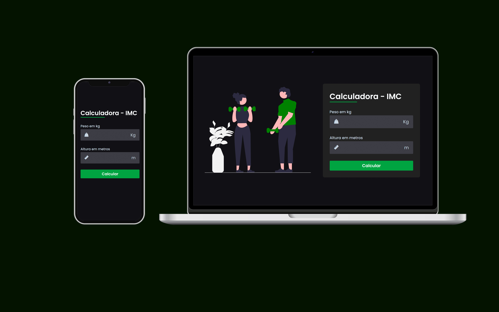

<h1 align="center">Calculadora de IMC</h1>

  

  

## 💻 Projeto

Este projeto foi idealizado com o objetivo de aprimorar minha expertise em HTML, CSS e JavaScript, através do suporte e recursos fornecidos pela Larissa Kich.

- [Acesse o projeto](https://calculadora-imc-one-rho.vercel.app/)

## 🚀 Tecnologias

Esse projeto foi desenvolvido com as seguintes tecnologias:

- JavaScript
- HTML e CSS
- Git e Github